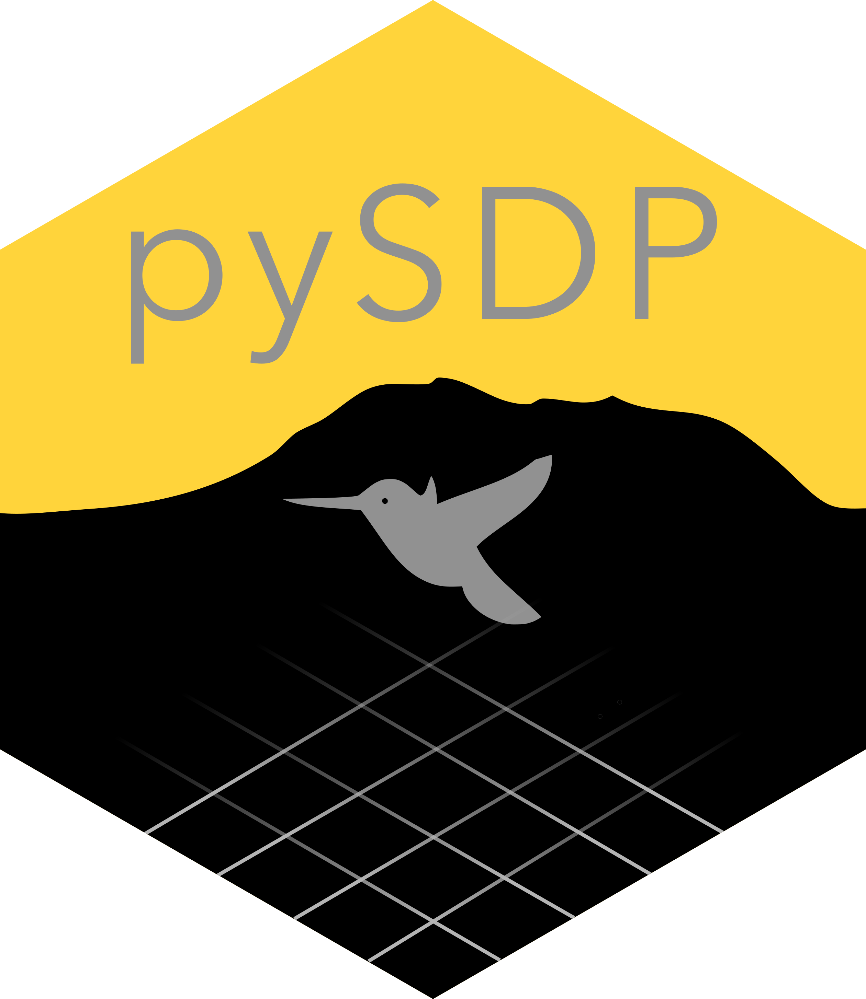

# pySDP 

[](https://pypi.org/project/pysdp/)
[](https://pypi.org/project/pysdp/)
[](https://github.com/rmbl-sdp/pySDP/actions/workflows/ci.yml)
[](https://rmbl-sdp.github.io/pySDP/)
[](./LICENSE)

Native Python interface for the [RMBL Spatial Data Platform](https://www.rmbl.org/scientists/resources/spatial-data-platform/) — curated, high-resolution geospatial datasets covering Western Colorado (USA) around [Rocky Mountain Biological Laboratory](https://rmbl.org).

**Lazy cloud access. Standard scientific-Python types. Feature-parity port of the [rSDP](https://github.com/rmbl-sdp/rSDP) R package.**

- 🌐 **No downloads needed** — open 1 GB COGs from S3 and extract point samples without a local copy. GDAL VSICURL handles the range reads.
- 🔄 **Composable return types** — `xarray.Dataset`, `geopandas.GeoDataFrame`, `pandas.DataFrame`. No custom classes to learn; everything plugs into the PyData ecosystem.
- 📅 **Time-series aware** — uniform `pandas.DatetimeIndex` across Daily / Monthly / Yearly products. `ds.sel(time="2019")`, `.resample`, `.groupby("time.year")` all work.
- 🚀 **Dask-ready** — lazy chunked reads via `chunks="auto"` (requires `pysdp[dask]`) let you scale to stacks that don't fit in memory.

📘 **Full documentation:** <https://rmbl-sdp.github.io/pySDP/>
📖 **[Getting started](https://rmbl-sdp.github.io/pySDP/getting-started/)** • **[User guides](https://rmbl-sdp.github.io/pySDP/guides/)** • **[API reference](https://rmbl-sdp.github.io/pySDP/api/)**

## Install

```bash
pip install pysdp                 # core: catalog, raster, extraction, download
pip install "pysdp[dask]"         # + lazy chunked reads via Dask
pip install "pysdp[stac]"         # + pystac-client + odc-stac for STAC
pip install "pysdp[hub]"          # + dask-gateway for JupyterHub clusters
pip install "pysdp[all]"          # everything
```

Requires Python 3.11+. All core deps (rasterio, rioxarray, xarray, geopandas, pystac, scipy, ...) have wheels on PyPI for Linux, macOS (Intel + Apple Silicon), and Windows — no system GDAL install needed.

## 30-second tour

```python
import pysdp
import geopandas as gpd

# Discover what's in the catalog
cat = pysdp.get_catalog(domains=["UG"], types=["Vegetation"])
cat[["CatalogID", "Product", "Resolution"]].head()

# Open a raster lazily — the 1 GB landcover COG stays on S3
landcover = pysdp.open_raster("R3D018")

# Sample at field sites (auto-reprojects to the raster's CRS)
sites = gpd.GeoDataFrame(
    {"site": ["Roaring Judy", "Gothic", "Galena Lake"]},
    geometry=gpd.points_from_xy(
        [-106.853186, -106.988934, -107.072569],
        [38.716995, 38.958446, 39.021644],
    ),
    crs="EPSG:4326",
)
samples = pysdp.extract_points(landcover, sites)
samples
```

See the [user guides](https://rmbl-sdp.github.io/pySDP/guides/) for deeper walkthroughs — catalog discovery, raster wrangling, field-site sampling, and making publication-quality maps.

## Public API

Seven functions cover the whole surface:

| Function | Purpose |
|---|---|
| `get_catalog()` | Discover SDP datasets (packaged snapshot, live, or STAC) |
| `get_metadata()` | Per-dataset XML metadata as dict or lxml Element |
| `open_raster()` | Lazy `xarray.Dataset` from an SDP cloud COG |
| `open_stack()` | Multi-product lazy stack (shared grid) |
| `extract_points()` | Sample values at point geometries |
| `extract_polygons()` | Zonal summaries over polygon geometries |
| `download()` | Bulk-fetch COGs to local disk |

Full signatures and examples: <https://rmbl-sdp.github.io/pySDP/api/>.

## Coming from rSDP?

pySDP is a direct port with the same catalog, same vocabulary, and feature parity. The [rSDP → pySDP mapping in SPEC §5](./SPEC.md#5-rsdp--pysdp-mapping) is the authoritative reference; the short version:

| rSDP (R) | pySDP (Python) |
| --- | --- |
| `sdp_get_catalog()` | `pysdp.get_catalog()` |
| `sdp_get_metadata()` | `pysdp.get_metadata()` |
| `sdp_get_raster()` | `pysdp.open_raster()` / `pysdp.open_stack()` |
| `sdp_extract_data(points)` | `pysdp.extract_points()` |
| `sdp_extract_data(polygons)` | `pysdp.extract_polygons()` |
| `download_data()` | `pysdp.download()` |
| `SpatRaster` | `xarray.Dataset` |
| `SpatVector` / `sf::sf` | `geopandas.GeoDataFrame` |

## Status & roadmap

**v0.1 (current):** feature-complete port of rSDP v0.2. Catalog discovery, metadata, lazy raster access, point/polygon extraction, bulk download — all with tests and CI across Python 3.11 / 3.12 / 3.13 × Linux / macOS / Windows.

**Upcoming** (see [ROADMAP.md](./ROADMAP.md) for details):

- Phase 7 — JupyterHub + Dask Gateway integration (`pysdp.hub`), GDAL cloud-tuning defaults
- Phase 8a — Distributed extraction partition helpers + at-scale recipes
- Phase 8b — Polygon zonal stats + benchmark harness

## Project documents

- [`SPEC.md`](./SPEC.md) — v0.1 design specification (API, dependencies, phased plan)
- [`ROADMAP.md`](./ROADMAP.md) — post-v0.1 integrations (Hub, distributed extraction)
- [`CHANGELOG.md`](./CHANGELOG.md) — release history
- [`docs/contributing.md`](./docs/contributing.md) — development setup + PR workflow

## License

MIT — see [LICENSE](./LICENSE).

## Citation

pySDP is part of the infrastructure around the RMBL Spatial Data Platform. If it supports your research, please cite the SDP (citation guidance at <https://www.rmbl.org/scientists/resources/spatial-data-platform/>). A formal citation for pySDP itself will be added at the 0.1.0 stable release.

## Acknowledgements

pySDP is developed by [Ian Breckheimer](https://github.com/ikbreck) and collaborators at Rocky Mountain Biological Laboratory. Built on the shoulders of giants: [xarray](https://docs.xarray.dev/), [rioxarray](https://corteva.github.io/rioxarray/), [rasterio](https://rasterio.readthedocs.io/), [geopandas](https://geopandas.org/), [pystac](https://pystac.readthedocs.io/), [xvec](https://xvec.readthedocs.io/), and [odc-stac](https://odc-stac.readthedocs.io/).
