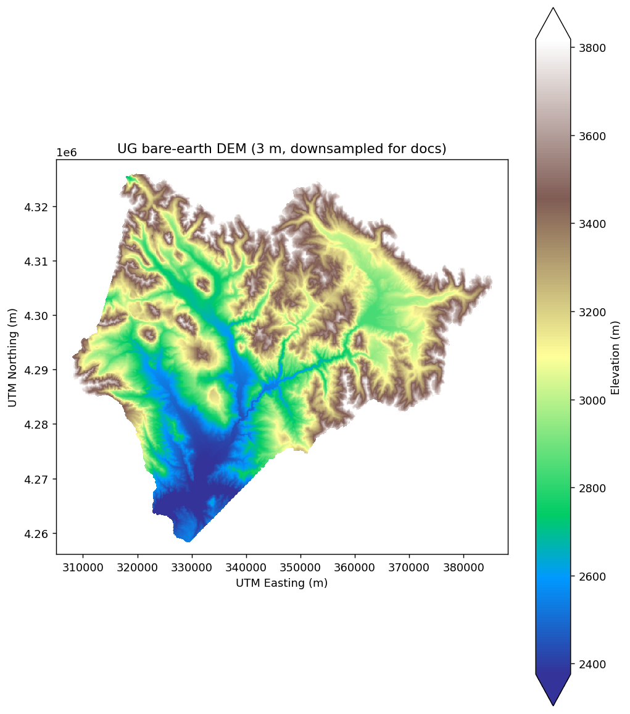

# Accessing cloud-based datasets

> **R counterpart:** [`sdp-cloud-data.Rmd`](https://github.com/rmbl-sdp/rSDP/blob/main/vignettes/sdp-cloud-data.Rmd) — the Python version below mirrors its structure.

The RMBL Spatial Data Platform hosts >100 curated raster products on S3 as cloud-optimized GeoTIFFs. `pysdp` lets you find, open, and work with these rasters without downloading the full files. This guide walks the basics.

## Setup

```bash
pip install "pysdp[dask]"  # dask enables lazy chunked reads (recommended)
```

```python
import pysdp
import geopandas as gpd
```

## Finding datasets

Get a DataFrame of the full catalog:

```python
cat = pysdp.get_catalog()
cat[["CatalogID", "Product", "Domain", "Resolution"]].head()
```

Narrow with filters:

```python
veg = pysdp.get_catalog(types=["Vegetation"])
```

For advanced filtering, work with the DataFrame directly — any pandas operation is fair game:

```python
snow = cat[cat["Product"].str.contains("Snow", case=False)]
snow[["CatalogID", "Product", "TimeSeriesType"]]
```

The `CatalogID` column is pySDP's canonical handle for each product. `R4D001`, for example, identifies the annual snow persistence time-series for the Upper Gunnison domain.

### Detailed metadata

Beyond the catalog DataFrame, each product has a companion XML metadata document describing provenance, sensors, processing history, etc.:

```python
meta = pysdp.get_metadata("R4D001")
meta["qgis"]["abstract"]
```

### Visualizing SDP domains

The four SDP domains (UG, UER, GT, GMUG) are small enough to plot together. Their boundary polygons are hosted alongside the raster products:

```python
domains = [
    ("UG",   "Upper Gunnison",         "https://rmbl-sdp.s3.us-east-2.amazonaws.com/data_products/supplemental/UG_region_vect_1m.geojson"),
    ("UER",  "Upper East River",       "https://rmbl-sdp.s3.us-east-2.amazonaws.com/data_products/supplemental/UER_region_vect_1m.geojson"),
    ("GT",   "Gothic Townsite",        "https://rmbl-sdp.s3.us-east-2.amazonaws.com/data_products/supplemental/GT_region_vect_1m.geojson"),
]

import pandas as pd
frames = [gpd.read_file(u).assign(Domain=name) for _, name, u in domains]
bounds = pd.concat(frames).pipe(gpd.GeoDataFrame, crs=frames[0].crs)
bounds.explore(column="Domain", tiles="Esri.NatGeoWorldMap", alpha=0.6)
```

`GeoDataFrame.explore()` produces a folium-backed interactive map — the geopandas analog of `terra::plet()` in rSDP:

<iframe src="assets/domains_map.html"
        width="100%" height="450" style="border:0" loading="lazy"
        title="Folium map of SDP spatial domains"></iframe>

## Connecting to data in the cloud

`open_raster()` returns an `xarray.Dataset` backed by a lazy COG read — no data is transferred until you `.compute()`, `.plot()`, or slice it.

### Single-layer products

```python
ug_elev = pysdp.open_raster("R3D009")  # UG bare-earth DEM, 3 m
ug_elev
```

Inspect the structure: dimensions, resolution, CRS (`EPSG:32613`), and data variable name. A quick plot:

```python
import matplotlib.pyplot as plt
ug_elev[next(iter(ug_elev.data_vars))].plot.imshow(cmap="terrain", robust=True)
plt.gca().set_aspect("equal")
```



*(The DEM here is downsampled by a factor of 60 for fast rendering in the docs; the full 3 m resolution is ~584 million cells and about 1 GB per read.)*

Cropping to an area of interest only fetches the portion of the COG that intersects the bounding box:

```python
gt_bounds = bounds[bounds["Domain"] == "Gothic Townsite"].to_crs(ug_elev.rio.crs)
gt_elev = ug_elev.rio.clip(gt_bounds.geometry, from_disk=True)
gt_elev
```

`from_disk=True` streams the crop directly from the COG via GDAL's windowed reads. Without it, rioxarray materializes the full raster first and then crops, which defeats the cloud-native access model.

### Time-series products

Many SDP products are daily, monthly, or annual time-series. Pass `years=` (for Yearly products), `months=` (Monthly), or `date_start` / `date_end` (any type) to slice the time dimension at open-time:

```python
snow_years = pysdp.open_raster("R4D001", years=[2018, 2019, 2020])
snow_years.sizes   # {'time': 3, 'y': ..., 'x': ...}
```

Check the catalog's `MinYear` / `MaxYear` / `MinDate` / `MaxDate` fields to see what's available:

```python
ts = cat[cat["TimeSeriesType"].isin(["Yearly", "Monthly", "Daily"])]
ts[["CatalogID", "Product", "TimeSeriesType", "MinDate", "MaxDate", "MinYear", "MaxYear"]]
```

## When to download data locally

Lazy cloud reads are ergonomic but have a cost — every data access triggers an HTTP range request. For operations that touch many cells (random sampling, whole-raster reductions, repeated algebra), local access is substantially faster.

```python
# 100-point random sample on a cloud-hosted snow time-series:
import time
t0 = time.time()
sample = snow_years.stack(pix=("y", "x")).isel(pix=slice(0, 100)).compute()
print(f"cloud sample: {time.time() - t0:.1f}s")
```

Use `pysdp.download()` to mirror to disk when needed:

```python
pysdp.download(catalog_ids="R4D001", output_dir="~/sdp-data", overwrite=False)
```

Then open from disk with `rioxarray.open_rasterio(...)`, or via the packaged CSV's `Data.URL` pointing at the local copy.

Operations that benefit most from local storage:

- Whole-raster reductions (mean, std over all cells)
- Resampling or reprojection (touches every pixel)
- Repeated extractions from the same product

For narrow operations — cropping to a small AOI, extracting at a handful of points — cloud reads are usually fast enough and save the download step.

## Next steps

- [Wrangling raster data](wrangle-rasters.md) — masking, reprojection, resampling, export
- [Field-site sampling](field-sampling.md) — extraction at points and polygons
- [Pretty maps](pretty-maps.md) — static + interactive visualization
