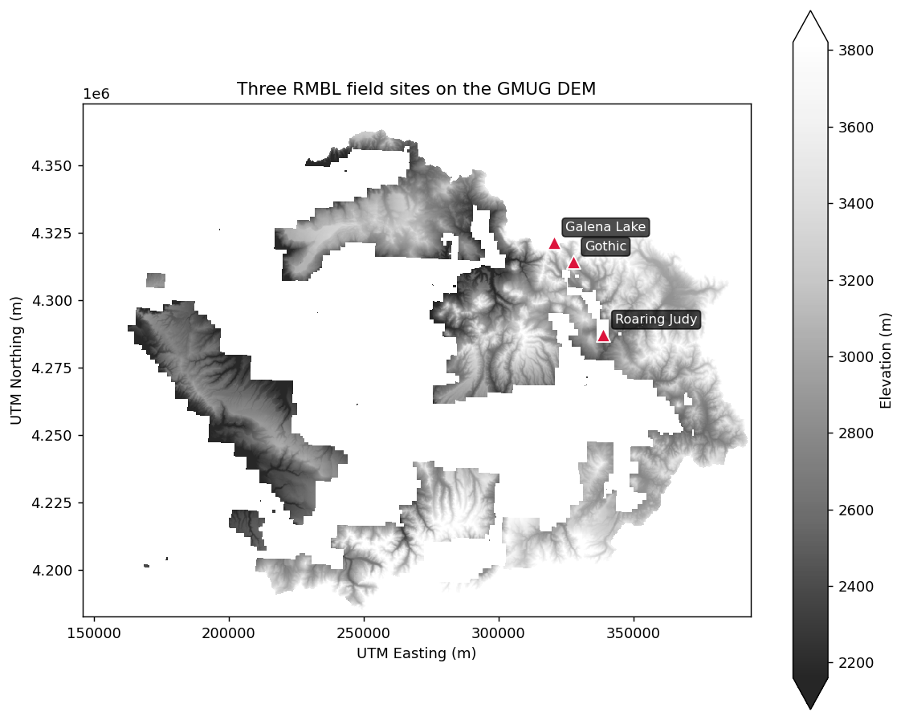
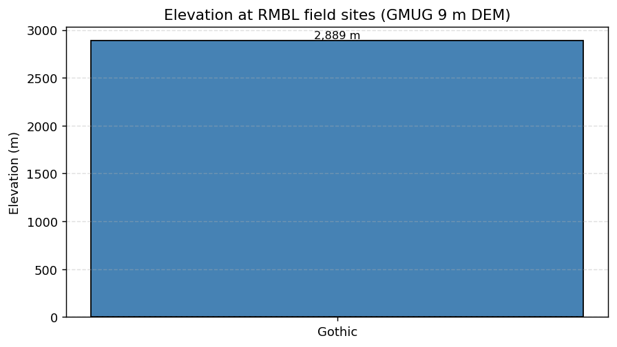

# Field-site sampling

> **R counterpart:** [`field-site-sampling.Rmd`](https://github.com/rmbl-sdp/rSDP/blob/main/vignettes/field-site-sampling.Rmd).

Typical SDP workflows pair environmental rasters with field measurements — soil moisture at a set of plots, snow depth across a watershed, canopy height in a study transect. This guide covers the extraction patterns pySDP supports.

## Setup

```python
import pysdp
import geopandas as gpd
import pandas as pd
from shapely.geometry import Point
```

## Reading in field-site data

### From tabular (CSV, Excel) with coordinate columns

The simplest case — you have a spreadsheet with lat/lon columns:

```python
# Construct for the tutorial
sites = pd.DataFrame({
    "site": ["Roaring Judy", "Gothic", "Galena Lake"],
    "lon":  [-106.853186, -106.988934, -107.072569],
    "lat":  [38.716995, 38.958446, 39.021644],
})

# pysdp accepts a plain DataFrame + explicit crs — no need to convert first
```

### From a geospatial file (GeoPackage, GeoJSON, Shapefile)

GeoPandas reads all three with the same API:

```python
sites = gpd.read_file("field_sites.gpkg")
# or
sites = gpd.read_file("field_sites.shp")
```

Verify the CRS is set — for lat/lon it should be `EPSG:4326`:

```python
sites.crs
```

## Simple extraction at points

```python
dem = pysdp.open_raster("R3D009")   # UG bare-earth DEM, 3 m

# DataFrame path (explicit CRS + x/y column names)
elevations = pysdp.extract_points(
    dem,
    pd.DataFrame({"site": ["Roaring Judy", "Gothic", "Galena Lake"],
                  "lon":  [-106.853186, -106.988934, -107.072569],
                  "lat":  [38.716995, 38.958446, 39.021644]}),
    x="lon", y="lat", crs="EPSG:4326",
)
elevations
```

pySDP auto-reprojects the points to the raster's CRS (`EPSG:32613` for all SDP rasters). Output is a `GeoDataFrame` with your input columns + the extracted elevation column.

Three field sites plotted on the DEM (Roaring Judy, Gothic, Galena Lake span the Gunnison basin):



And the extracted elevations as a simple bar chart:



*(The plot uses the GMUG 9 m DEM; only Gothic falls within GMUG, so the bar chart shows that one site. The extraction code above works identically against the UG 3 m DEM — same API, just slower to run on the larger raster.)*

## Buffered extraction at points with summaries

"Extract the mean canopy height within 20 m of each site" is a polygon operation in disguise — buffer each point and run polygon extraction:

```python
sites_gdf = gpd.GeoDataFrame(
    sites,
    geometry=gpd.points_from_xy(sites["lon"], sites["lat"]),
    crs="EPSG:4326",
).to_crs("EPSG:32613")  # project so buffers are in meters

sites_gdf["buffer_20m"] = sites_gdf.geometry.buffer(20)
buffers = sites_gdf.set_geometry("buffer_20m", crs="EPSG:32613")

canopy = pysdp.open_raster("R3D015")  # UG Vegetation Canopy Height
mean_canopy = pysdp.extract_polygons(canopy, buffers, stats=["mean", "std"])
```

## Extracting summaries from polygons (watersheds, plots)

```python
watersheds = gpd.read_file("watersheds.gpkg")

snow = pysdp.open_raster("R4D001", years=[2018, 2019, 2020])  # annual snow persistence
snow_stats = pysdp.extract_polygons(snow, watersheds, stats="mean")
snow_stats
```

Output is long-form for time-series rasters (one row per `watershed × year`). Pivot to wide if you want the rSDP layout:

```python
wide = snow_stats.pivot_table(
    index="HYD_ID",           # your watershed ID column
    columns="time",
    values="UG_snow_persistence_27m_v1",
)
```

## Categorical summaries

For landcover-style categorical rasters, "mean" isn't meaningful — you probably want the fraction of each class. `stats=["count"]` + manual grouping works:

```python
landcover = pysdp.open_raster("R3D018")   # UG Basic Landcover
# Per-polygon cell counts (one row per polygon × class value)
# would be an 'all_cells' workflow — tracked in ROADMAP §Phase 8a.
```

For v0.1, the workflow is:

1. Clip the landcover raster to each polygon (`rio.clip`)
2. Flatten and use `pd.Series.value_counts()` on the result

A helper for this will be part of the `all_cells=True` work in a later release.

## Performance strategies

Extraction from large cloud-hosted rasters can be slow — one HTTP request per ~512×512 block that intersects any geometry. Speedup options, in order of impact:

### 1. Crop before extract

```python
bbox = sites_gdf.total_bounds  # in the raster's CRS
cropped = dem.rio.clip_box(*bbox)  # small subset, single range read
out = pysdp.extract_points(cropped, sites_gdf)
```

### 2. Download locally for repeated use

```python
pysdp.download(catalog_ids="R4D001", output_dir="~/sdp-data")
```

Then open the local file with `rioxarray.open_rasterio` for all subsequent work.

### 3. Parallelize across polygons / points

Dask-aware extraction at large scale is a research problem we're actively working — see [ROADMAP §Phase 8a](https://github.com/rmbl-sdp/pySDP/blob/main/ROADMAP.md) for the partition-and-reduce recipe that'll ship with pySDP 0.1.x / 0.2.

For now, a good pragmatic pattern is splitting your geometries into chunks and using `concurrent.futures.ThreadPoolExecutor` or `dask.delayed`:

```python
from concurrent.futures import ThreadPoolExecutor

def extract_chunk(chunk_gdf):
    return pysdp.extract_points(dem, chunk_gdf, verbose=False)

chunks = [sites_gdf.iloc[i:i+1000] for i in range(0, len(sites_gdf), 1000)]
with ThreadPoolExecutor(max_workers=4) as executor:
    results = list(executor.map(extract_chunk, chunks))
combined = pd.concat(results, ignore_index=True)
```

## Next steps

- [Pretty maps](pretty-maps.md) — visualizing the extracted data
- [API reference](../api.md) for the full option list on `extract_points` / `extract_polygons`
