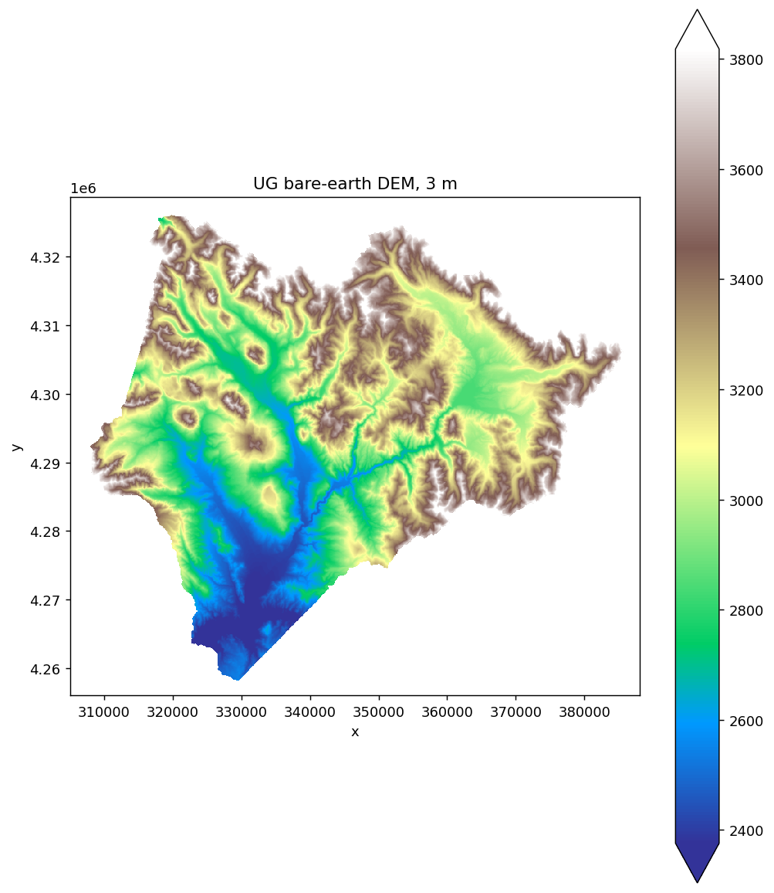
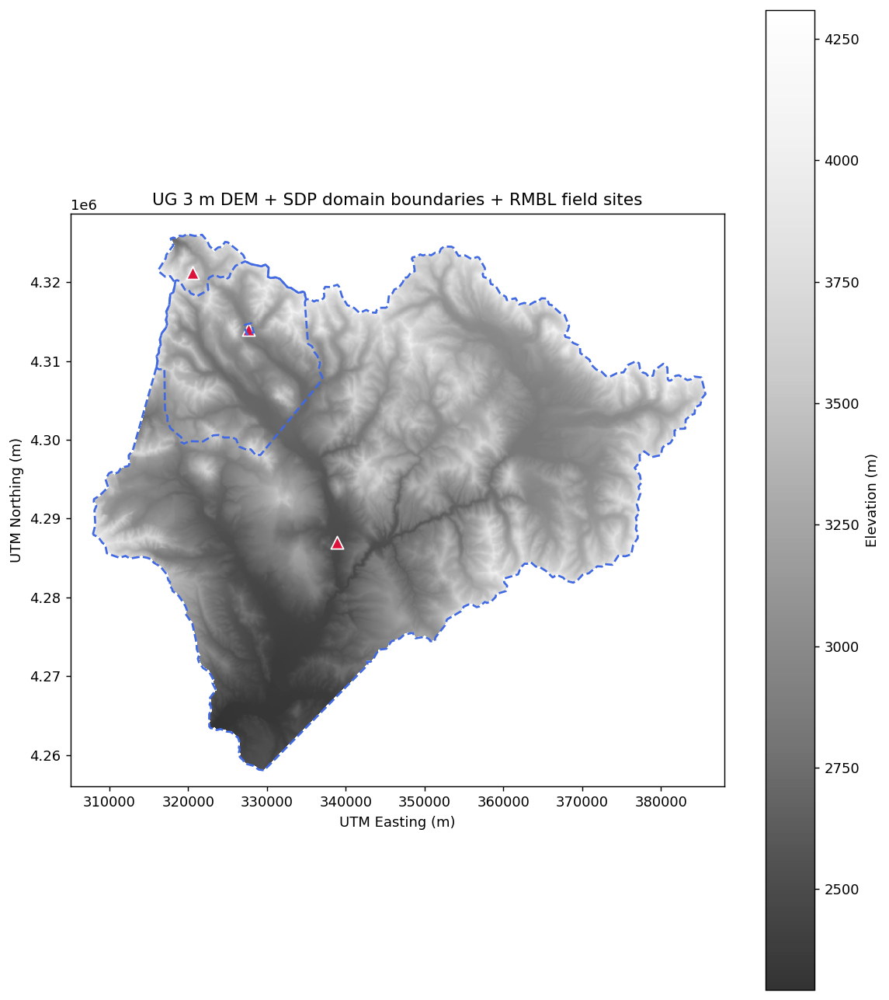
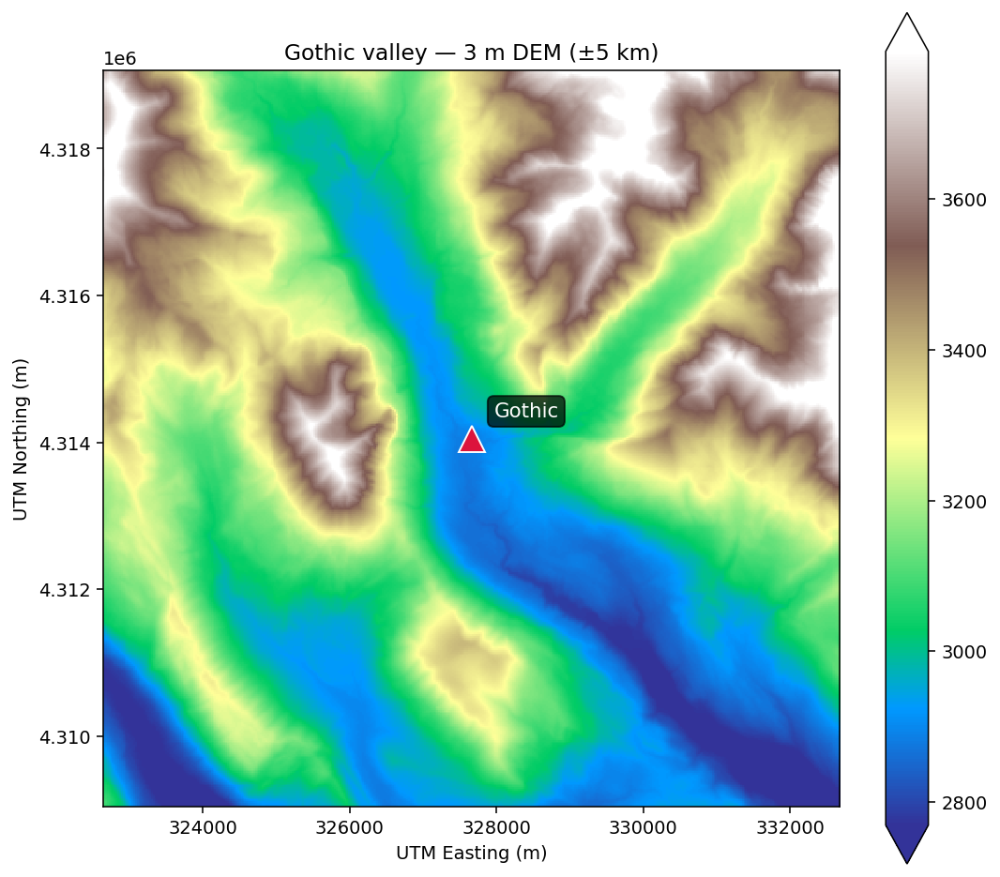

# Pretty maps

> **R counterpart:** [`pretty-maps.Rmd`](https://github.com/rmbl-sdp/rSDP/blob/main/vignettes/pretty-maps.Rmd).

`pysdp` doesn't ship its own plotting layer — it returns `xarray.Dataset` and `geopandas.GeoDataFrame` objects that compose with the rest of the PyData viz ecosystem. This guide covers the three common paths:

- **Static maps** with `matplotlib` + `xarray.plot` (for papers, reports)
- **Interactive web maps** with `folium` / `GeoDataFrame.explore()` (for exploration, notebooks)
- **Publication-quality faceted figures** with `matplotlib` subplots or `hvplot`

## Setup

```bash
pip install "pysdp[viz]"   # pulls in matplotlib + folium
```

```python
import pysdp
import geopandas as gpd
import matplotlib.pyplot as plt
```

## Loading data

```python
# Digital elevation model — the base layer for most maps
dem = pysdp.open_raster("R3D009", chunks=None)  # UG 3 m bare-earth DEM

# Vector overlays — load any GeoJSON / GPKG / Shapefile with geopandas
bounds = gpd.read_file(
    "https://rmbl-sdp.s3.us-east-2.amazonaws.com/data_products/supplemental/UG_region_vect_1m.geojson"
)
```

## Basic raster map with matplotlib

```python
fig, ax = plt.subplots(figsize=(8, 9))
dem[next(iter(dem.data_vars))].plot.imshow(ax=ax, cmap="terrain", robust=True)
ax.set_aspect("equal")
ax.set_title("UG bare-earth DEM (3 m)")
plt.tight_layout()
```

`.plot.imshow()` is xarray's matplotlib wrapper — it handles colorbars, axis labels, and CRS-aware extent automatically. `robust=True` clips extreme outliers so the colormap stays useful.

*Tip:* at full resolution the 3 m DEM is ~584 M cells, which is too much to plot directly. Downsample first with `dem.coarsen(x=60, y=60, boundary="trim").mean()` (or pre-crop to your AOI) before plotting.



## Web maps with folium

For exploration in a notebook, `GeoDataFrame.explore()` gives you a pan/zoom map with a single call:

```python
import folium
m = bounds.explore(column="Domain", tiles="Esri.WorldImagery", cmap="Set2")
for _, row in sites.iterrows():
    folium.Marker(
        location=[row.geometry.y, row.geometry.x],
        popup=row["site"],
        icon=folium.Icon(color="red", icon="star"),
    ).add_to(m)
m
```

<iframe src="assets/pretty_web.html"
        width="100%" height="450" style="border:0" loading="lazy"
        title="Folium map of SDP domains with field-site markers"></iframe>

To overlay a raster on a folium map, use `folium.raster_layers.ImageOverlay` with an RGBA PNG you've rendered from the xarray data. That's more setup — for quick visual checks, `xarray.plot` + `matplotlib` is usually faster.

## Faceted multi-panel maps

Showing multiple years of a time-series product side-by-side:

```python
snow = pysdp.open_raster("R4D001", years=[2018, 2019, 2020], chunks=None)

fig = snow["UG_snow_persistence_27m_v1"].plot.imshow(
    col="time", col_wrap=3,
    cmap="Blues", robust=True,
    figsize=(14, 5),
)
```

xarray auto-creates the subplot grid from the `col="time"` faceting argument.

## Adding overlays

Combine raster + vector on one figure:

```python
fig, ax = plt.subplots(figsize=(10, 8))

# Base: DEM in grey
dem[next(iter(dem.data_vars))].plot.imshow(
    ax=ax, cmap="Greys_r", add_colorbar=True, alpha=0.8,
)

# Overlay: domain boundaries in the raster's CRS
bounds.to_crs(dem.rio.crs).boundary.plot(
    ax=ax, color="royalblue", linewidth=1.5, linestyle="--",
)

# Overlay: field sites
from shapely.geometry import Point
sites = gpd.GeoDataFrame(
    {"site": ["Roaring Judy", "Gothic", "Galena Lake"]},
    geometry=[
        Point(-106.853186, 38.716995),
        Point(-106.988934, 38.958446),
        Point(-107.072569, 39.021644),
    ],
    crs="EPSG:4326",
).to_crs(dem.rio.crs)
sites.plot(ax=ax, color="crimson", markersize=80, marker="^", edgecolor="white")

ax.set_title("UG 3 m DEM + SDP domain boundaries + RMBL field sites")
ax.set_aspect("equal")
plt.tight_layout()
```



## Zooming in

Crop to an AOI before plotting for faster rendering and sharper detail:

```python
# 5 km buffer around Gothic, in UTM 13N
gothic_utm = sites.iloc[[1]].geometry.iloc[0]
buffer = 5_000
clipped = dem[next(iter(dem.data_vars))].rio.clip_box(
    gothic_utm.x - buffer, gothic_utm.y - buffer,
    gothic_utm.x + buffer, gothic_utm.y + buffer,
)

fig, ax = plt.subplots(figsize=(8, 7))
clipped.plot.imshow(ax=ax, cmap="terrain", robust=True)
ax.set_title("Gothic valley — 3 m DEM (±5 km)")
ax.set_aspect("equal")
```



## Exporting

PNG (for web, reports):

```python
plt.savefig("dem_map.png", dpi=300, bbox_inches="tight")
```

PDF (for publication):

```python
plt.savefig("dem_map.pdf", bbox_inches="tight")
```

GeoTIFF of a styled map isn't straightforward with matplotlib — if you need a georeferenced map image for GIS, write the raster directly with `rio.to_raster` and restyle downstream.

## Alternatives worth knowing

- **`hvplot`** — interactive notebook plots via holoviews: `dem.hvplot.image(x="x", y="y")`. Nice for lots of zooming.
- **`lonboard`** — GPU-accelerated map rendering for large vector datasets; excellent for 100k+ point displays.
- **`leafmap`** — folium/ipyleaflet wrapper with sensible defaults for Earth-observation workflows; supports COG display directly.

For static publication figures, matplotlib + `xarray.plot` remains the most-used path.

## Next steps

- [Field-site sampling](field-sampling.md) — generating the extracted data that your maps visualize
- [API reference](../api.md) for pySDP's full function surface
